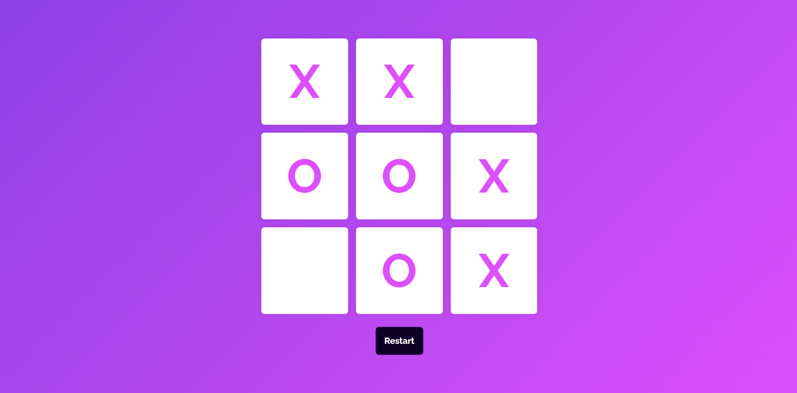

# 🎮 Tic Tac Toe Game

A simple and fun Tic Tac Toe game built using **HTML**, **CSS**, and **JavaScript**. Two players can take turns to mark 'X' and 'O' on a 3x3 grid, with the game determining the winner or a draw automatically. Clean UI, responsive layout, and celebratory win messages included! 🎉

---

## 🚀 Features

- 🧠 Smart win-checking logic
- 🔁 Restart and New Game functionality
- 🖥️ Responsive design using `vmin` for scalable layout
- 🎨 Gradient backgrounds and styled buttons
- 💬 Pop-up messages for win/draw with emojis

---

## 📂 Project Structure

```
tic-tac-toe/
├── index.html        # Main HTML structure
├── style.css         # All styles for layout and animations
├── script.js         # Game logic and interactions
├── demo.png          # Screenshot of the game UI
└── README.md         # Project documentation
```

---

## 🛠️ Technologies Used

- **HTML5** – Markup structure
- **CSS3** – Styling and layout
- **JavaScript (ES6)** – Game logic and DOM manipulation
- **Google Fonts** – Custom font (Raleway)

---

## 📸 Screenshot



---

## ▶️ How to Play

1. Open `index.html` in your browser.
2. Click any empty cell to place your mark.
3. Player 'X' starts first, followed by Player 'O'.
4. The game ends when:
   - One player gets 3 in a row (win).
   - All cells are filled without a winner (draw).
5. Use **Restart** to replay or **New Game**

---

## 💬 Feedback

Found a bug or have a suggestion? Feel free to open an issue or submit a pull request.

---

Enjoy playing! 🎮
---
